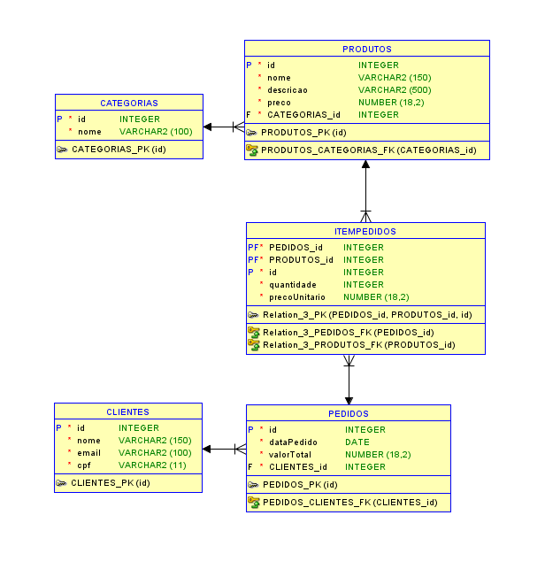

# Checkpoint 2 - Persistência com EF Core e Camada de Infraestrutura

## 👥 Integrantes do Grupo
* **Nome:** Pedro Sakai - **RM:** 565956

---

## 🛒 Domínio Escolhido
**Loja de Equipamentos Eletrônicos**
O sistema tem como objetivo gerenciar o catálogo de produtos, categorias e o fluxo de vendas (pedidos) de uma loja especializada em eletrônicos. O modelo foca na organização de estoque por categoria e na rastreabilidade de pedidos realizados por clientes cadastrados.

---

## 🗄️ SGBD Utilizado
* **Oracle Database**
* Provider: `Oracle.EntityFrameworkCore`

---

## 🏗️ Instruções de Execução e Migrations

### 1. Configuração do Banco
No arquivo `appsettings.json` do projeto **EletronicosStore.API**, configure a sua Connection String:
```json
"ConnectionStrings": {
  "OracleConnection": "Data Source=SeuCaminhoOracle;User Id=SeuUsuario;Password=SuaSenha;"
}


